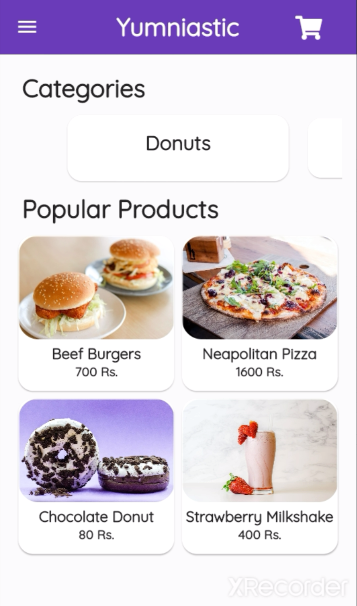

<h1 align="center">Welcome to Flutter Yumniastic 👋</h1>
<!-- ALL-CONTRIBUTORS-BADGE:START - Do not remove or modify this section -->
[](#contributors-)
<!-- ALL-CONTRIBUTORS-BADGE:END -->
<p>
  
  <a href="https://github.com/1hanzla100/flutter-yumniastic/blob/master/README.md" target="_blank">
    
  </a>
  <a href="https://github.com/1hanzla100/flutter-yumniastic/blob/master/LICENSE" target="_blank">
    
  </a>
  <a href="https://twitter.com/1hanzla100" target="_blank">
    
  </a>
</p>

> Yumniastic is a online food delivery service app built with Flutter and Django

</img>
## 🚀 [DEMO](https://github.com/1hanzla100/flutter-yumniastic/releases)
## Getting Started

To get a local copy up and running follow these simple example steps.

Prerequisite: https://flutter.dev/docs/get-started/install

1. To get started, fork this repository to your GitHub account.

2. Clone the repo.
    ```sh
     git clone https://github.com/1hanzla100/flutter-yumniastic
    ```
3. Install packages.
    ```sh
     flutter pub get
    ```
4. Run project.
    ```sh
     flutter run
    ```

## Author

👤 **Hanzla Tauqeer**

* Website: https://hanzla.now.sh
* Twitter: [@1hanzla100](https://twitter.com/1hanzla100)
* Github: [@1hanzla100](https://github.com/1hanzla100)
* LinkedIn: [@1hanzla100](https://linkedin.com/in/1hanzla100)

## 🤝 Contributing

Contributions, issues and feature requests are welcome!<br />Feel free to check [issues page](https://github.com/1hanzla100/flutter-yumniastic/issues). You can also take a look at the [contributing guide](https://github.com/1hanzla100/flutter-yumniastic/blob/master/CONTRIBUTING.md).

## Show your support

Give a ⭐️ if this project helped you!

## 📝 License

Copyright © 2021 [Hanzla Tauqeer](https://github.com/1hanzla100).<br />
This project is [GPL-3.0](https://github.com/1hanzla100/flutter-yumniastic/blob/master/LICENSE) licensed.

## Contributors ✨

Thanks goes to these wonderful people ([emoji key](https://allcontributors.org/docs/en/emoji-key)):

<!-- ALL-CONTRIBUTORS-LIST:START - Do not remove or modify this section -->
<!-- prettier-ignore-start -->
<!-- markdownlint-disable -->
<table>
  <tr>
    <td align="center"><a href="https://hanzla.now.sh"><br /><sub><b>Hanzla</b></sub></a><br /><a href="https://github.com/1hanzla100/flutter-yumniastic/commits?author=1hanzla100" title="Code">💻</a></td>
  </tr>
</table>

<!-- markdownlint-restore -->
<!-- prettier-ignore-end -->

<!-- ALL-CONTRIBUTORS-LIST:END -->

This project follows the [all-contributors](https://github.com/all-contributors/all-contributors) specification. Contributions of any kind welcome!